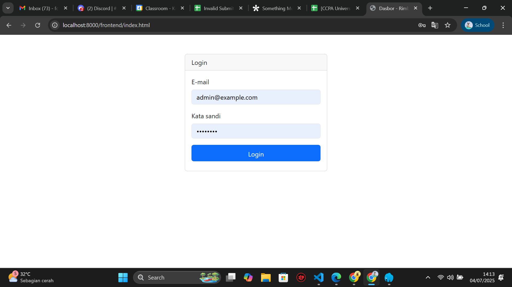
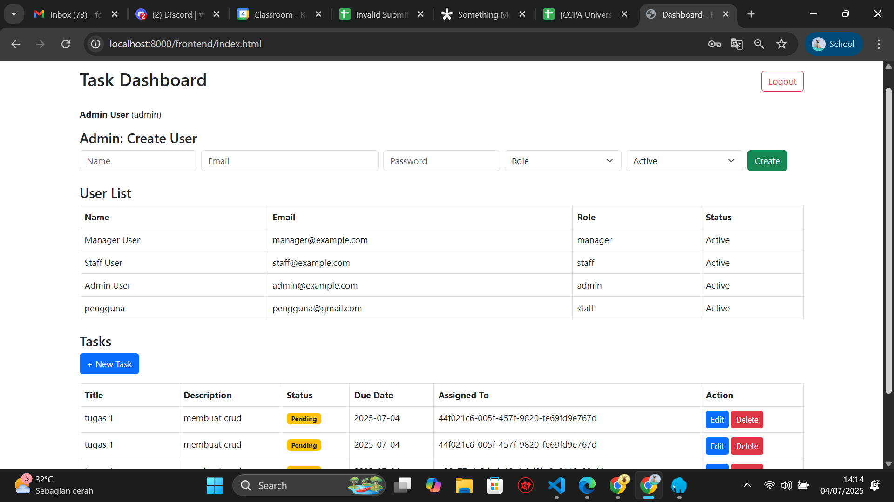
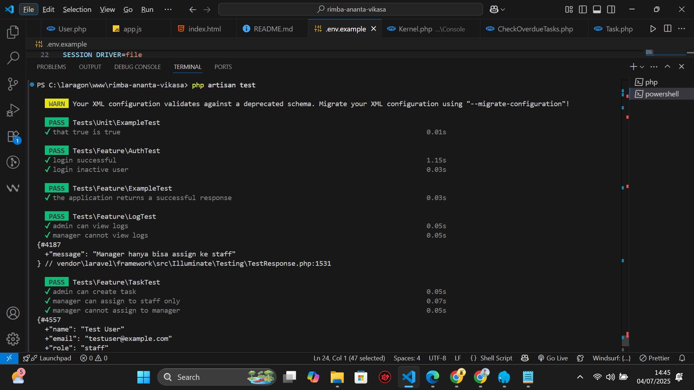
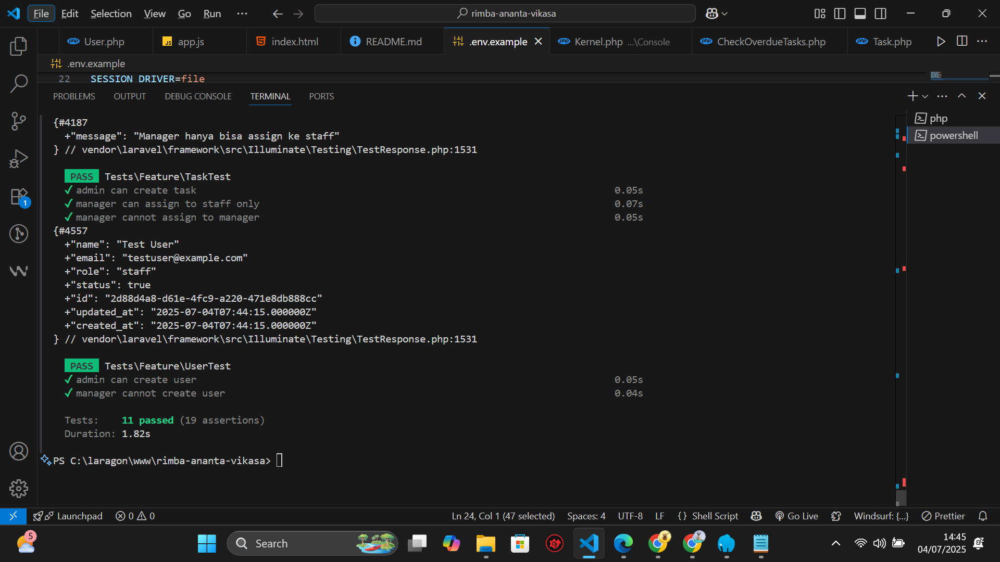

# Rimba Ananta Vikasa - RESTful API Manajemen User & Task

## Fitur
- Role-based access: admin, manager, staff
- CRUD User & Task, Activity Log
- Autentikasi Sanctum
- Scheduler: Task overdue checker
- Frontend: Vanilla JS + Bootstrap
- Unit & Feature Test (php artisan test)
- Edit & Delete Task via AJAX (frontend)
- Policy & Middleware (akses sesuai role)
- Dashboard Admin (statistik, log)
- Dokumentasi & contoh screenshot

## Setup
1. Clone repo & install depedensi
   ```bash
   composer install
   npm install && npm run build
   cp .env.example .env
   php artisan key:generate
   # Edit .env sesuai database Anda
   ```
2. Migrasi & seeder
   ```bash
   php artisan migrate:fresh --seed
   ```
3. Jalankan server
   ```bash
   php artisan serve
   ```
4. Akses frontend di `public/frontend/index.html`

## ERD (Singkat)
- User: id(UUID), name, email, password, role, status, email_verified_at
- Task: id(UUID), title, description, assigned_to, status, due_date, created_by
- ActivityLog: id(UUID), user_id, action, description, logged_at

## Testing
```bash
php artisan test
```
- Untuk coverage:
```bash
php artisan test --coverage
```
*Pastikan Xdebug sudah aktif untuk coverage*

## Scheduler
```bash
php artisan schedule:work
```

## Akun Dummy
- admin@example.com / password
- manager@example.com / password
- staff@example.com / password

## Screenshot
Silakan tambahkan screenshot hasil login, dashboard, dan fitur utama di bawah ini:






> Simpan file screenshot di folder `screenshots/` (buat jika belum ada)

## Struktur Folder
- app/Http/Controllers, Models, Policies, Services, Console/Commands
- routes/api.php
- public/frontend/index.html, app.js
- tests/Feature, Unit
- .env.example, README.md

## Author
- (Nama Anda)

---

<p align="center"><a href="https://laravel.com" target="_blank"></a></p>

<p align="center">
<a href="https://github.com/laravel/framework/actions"></a>
<a href="https://packagist.org/packages/laravel/framework"></a>
<a href="https://packagist.org/packages/laravel/framework"></a>
<a href="https://packagist.org/packages/laravel/framework"></a>
</p>

---

## Catatan
- Untuk fitur coverage, pastikan Xdebug sudah aktif di PHP (cek dengan `php -m | findstr xdebug`).
- Untuk screenshot, simpan file PNG/JPG di folder `screenshots/` dan update link di README ini.
- Jika ada error test, cek migration dan kolom database sudah sesuai.
